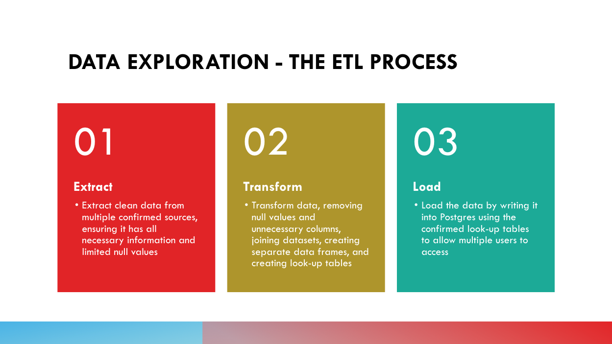
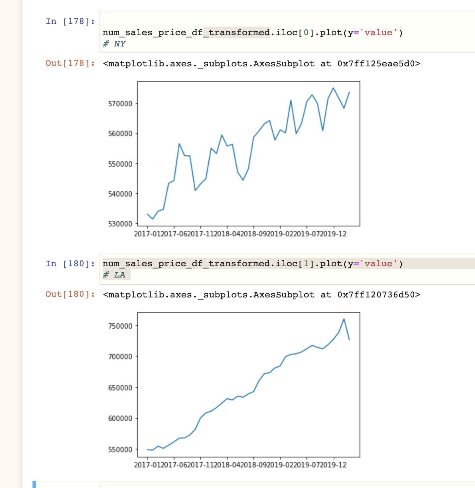
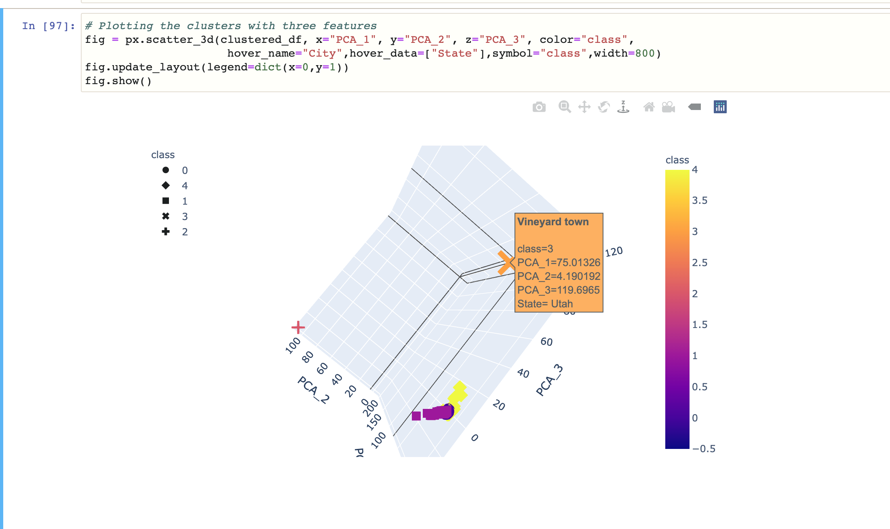
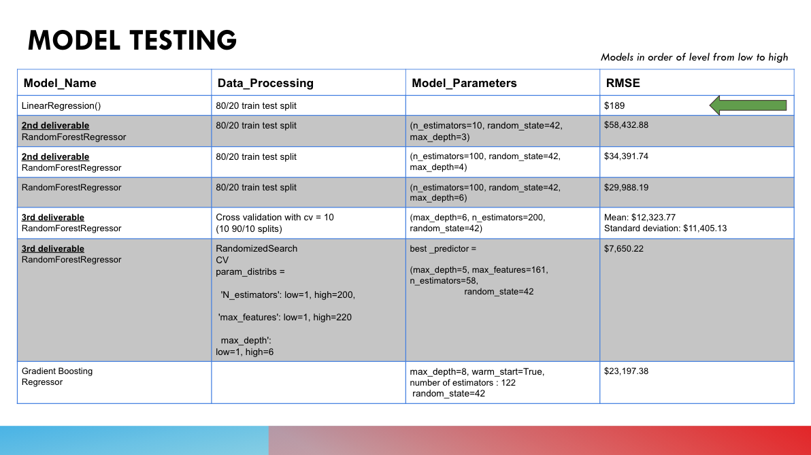

# Housing Trends in the Top 50 US Cities

UC Berkeley Extension Data Analytics Bootcamp Final Project

---

## This is the GitHub repository for our group's final project. 

### Group Members:

| Member               	| Role 	                 | Responsibilities                                                 |
|----------------------	|---------------------   | -------------                                                    |
| [Markeia Brox-Chester](https://github.com/markeiabc)|  Project Manager    	 |  Manage the Project Presentation, Technology, and Communication  |
| [Abigail Woolf](https://github.com/Abigail-Woolf)    	|  Database Lead         |  Manage the Database and ETL Process                             |
| [Robert Rustia](https://github.com/misterrustia)       	|  Machine Learning Lead |  Manage the Machine Learning Model and Design 	                |
| [Sathvik Aithala](https://github.com/sathvikaithala)    	|  Dashboard Lead  	     |  Manage the GitHub Repository and Presentation Dashboard         |

While members are assigned specific roles, we all work together on each part of the project. 

---

## Selected Topic - Housing Trends

Overview: Housing prices in the United States (US) continue to increase as incomes rise, unemployment drops, and industries grow. Our team selected this topic in order to predict how housing prices will change over the years as we decide where we want to relocate long-term.

Objective: By analyzing housing market data and trends between 2015-2019, the Housing Price Prediction Tool will predict whether the housing market will rise or drop in the 50 largest cities in the US. For example, someone who works in the Technology sector will be able to compare the income, housing price, and population demographics of San Francisco, Austin, and Seattle while they are applying for jobs. This could help them better understand similarities and differences between different cities and aid their decision making process. 

## Questions we would like to answer are:

- Given the data available, can we expect housing prices to increase or decrease in the coming years?
    - *Using demographic, income, housing price, job industries, and rent/buy ratios in a city to help come to this prediction.
    
- For a given city, which other US cities have similar housing and demographic data?
    - *For example, if a person is working in the tech sector and is looking for a new city to move to, they will be able to see a list of cities similar to San Francisco or Austin that may not be as obvious.
    
- Given a city name, what pertinent information should be understood by someone looking to move to the area?
    - *Our dashboard would allow a user to see charts of demographic data, income data, housing prices, crime, and unemployment rates, and trends over time for each city. 

#### Locations of various project deliverables:

| Objective | Location |
|-----------|-----------|
|Presentation| [Google Slides](https://drive.google.com/file/d/10OQSpUDdGAvfv400hQJ3XEkmrohSWTQC/view?usp=sharing)|
|Exploratory Analysis code | GitHub Master Branch -  Zhvi_all_city.ipynb |
|Machine Learning code and output | GitHub Master Branch - Resources folder |

#### Presentation:
Our presentation is hosted on Google Slides, and can be found [here](https://drive.google.com/file/d/10OQSpUDdGAvfv400hQJ3XEkmrohSWTQC/view?usp=sharing).

###### Technologies & Tools Used:

###### Data Exploration Phase:

###### Data Analysis Phase:
Detailed descriptions of our data analysis can be found in our [presentation](https://drive.google.com/file/d/10OQSpUDdGAvfv400hQJ3XEkmrohSWTQC/view?usp=sharing).

Here are the housing price trends of New York (top) and Los Angeles (bottom), after we cleaned null values from our data. We found that the housing prices in Los Angeles to rise in a more linear and predictable fashion compared to New York, which was more sporadic.

- Looking at two cities, New York and Los Angeles, we found that housing prices have increased over the years, but not steadily for all cities.
- New York’s (top graph) housing market has large increases and decreases in shorter periods of time.
- Los Angeles’s (bottom graph) housing market shows small increases each year, but less decreases.
- When comparing this trend to unemployment rates, Los Angeles has consistently decreased, while New York has fluctuated.
- Preliminary Conclusion: Given the data for New York, it is possible some city housing markets may drop within the next few months, instead of assuming all will continue to rise. 

###### Data Sources:

[Kaggle: Zillow US House Price Data](https://www.kaggle.com/paultimothymooney/zillow-house-price-data)

[Census: US City and Town Population Totals: 2010-2019](https://www.census.gov/data/tables/time-series/demo/popest/2010s-total-cities-and-towns.html)

[Bureau of Labor Statistics - Unemployment Rates by City](https://www.bls.gov/lau/data.htm)

[Kaggle: MoveHub City Ranking Data](https://www.kaggle.com/blitzr/movehub-city-rankings)

[Bureau of Labor Statistics: Concentrations of Industry](https://towardsdatascience.com/employment-growth-trends-by-industry-and-city-a-data-study-5002bf20692)

#### Database:
- For our database, we will be using PostgreSQL by use of pgAdmin and we are also hosting our raw data in an AWS S3 bucket. This enables anyone with the access codes to work the project data. The image below represents the tables of data that are uploaded onto the database in Postgres. The entity relational diagram allowed for easier joining of tables with SQL and was a helpful reference while importing data into the database. There are three main tables with data that were used to build and perform the machine learning model. 

- The most common and obvious connect between all of our datasets is the State column. 

#### Machine Learning:

###### Preliminary Data Processing:
- The first steps were to check the kind of data types were inside of the CSV file housing our data for each city. We found that our dataset had city name, state, county and average sales price for all home types inside of that city with time steps of months from 2006 to 2020. 

- The next was to check for duplicates and null values in the dataframe we created. We chose to keep the first of each of the duplicates and drop all rows (cities) that had more than 10% null values. This left a little over 17,000 cities with data from the year 2016-2020.

In the first week, we were able to complete the initial unsupervised clustering. We attained the following 3D Pricincipal Cluster Analysis Plot from this data.

###### Preliminary Feature Engineering, Feature Selection, & Decision-making Process:
- For the null values we decided to use a KNN (K-Nearest-Neighbors) imputer to fill in the values, as a simple imputer would have used the mean or median housing price. For housing data with large variances between large cities like New York and small towns, we believed that nearest-neighbor medians would not skew the data as much as the median of the whole column. 

- With the 4 years of monthly time-step data for the remaining 17,000 cities, the categorical features of the state that the cities were in was ordinal-encoded, then one-hot-encoded, and finally added into the data frame to be used as a feature with the rest of the time series data. This brought the total number of columns  from 177 to 224. 

###### Splitting Data Into Testing & Training sets:
For our final linear regression model, we used an 80/20 testing/training split to achieve our results. The testing/training splits we tried in other methods are shown in the table below.

###### Explanation of Model Choice (Including Limitations & Benefits):

Here are the models we tried, along with results we got:

The Linear Regression model outperformed the closest model by 40x RMSE. Since it was the most simple solution, we tried a few other models as well to see if we could outperform it.

The second closest was random forest regression that was placed through a stochastic cross validation with a RMSE of $7650.22. 

This model is over 3x more accurate than the other random forest models attempted 

This includes the Gradient BoostingRegressor which is built to optimize validation error, while also stopping training trees before overfitting occurs. 

#### Dashboard:

We used *Tableau* to create and host our dashboard. It will be directly tied to our Postgres database hosted on AWS via a direct connection.

Our dashboard can be found [here](https://public.tableau.com/profile/sathvik.aithala#!/vizhome/HousingPrices_16030731374470/Dashboard), or embedded on this [website](https://markeiabc.github.io/Housing_Data_Website/) we have created to present our final project.

#### Analysis Results:

After completing the the project and viewing the prediction, we can see that not all housing prices will be increasing in the next year. The machine learning model selected allowed us to get a RMSE of less than $200, which offers a strong prediction from the data provided. If we look at a city like Honolulu for example, we can determine that other factors may be an indicator of the housing market decline. The unemployment rate dropped from 2018 to 2019, but the percentage decrease was a lot smaller that in years past, which can indicate the unemployment percentage will begin to either level out or increase. This can then impact the housing market as more people are unable to purchase homes. New York shows a similar scenario. We also noticed that some cities housing prices are not increasing at such a high rate as they have done in years past. Boston for instance, is beginning to level out. 

In conclusion, the data pointwe provided can be corelated in determining the increase or decrease of the housing market. We also believe there are many other data points we should look at the get a better picture. For example, viewing by zipcode instead of city, looking at polital party majority in the area, weather, etc. 

#### Recommendations for Future Analysis:
- We would explore more machine learning models and fine tune them to try and get a better fitting model.
- We would try a Recurrent Neural Net model with timestamp data.

#### Improvements We Would Have Made:
One major area where we feel we could have improved our project is by taking more time to discover more data sets and factors that may influence housing prices. There are likely many variables we could not find data on handily, and that would probably be the best place to improve our project.

